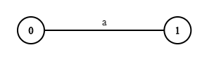
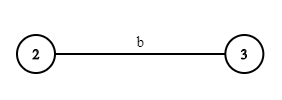

# CD Lab

## 1. Thomson's Construction 

Can use it to understand what is happening.

#### * A Node:

```
  typedef struct Node {
    int dest;
    char edge;
    struct Node *next;
} Node;
     ______________________
    |       |      |       |
    |   1   |   a  |  NULL | 
    |_______|______|_______|   
    
```

####  The graph array (final):
```
  Node * graph[100]; 
  
   ______      ______________________
  |      |    |       |      |       |
 0|   ---|--->|   1   |   a  |  NULL | 
  |______|    |_______|______|_______|
  |      |    |       |      |       |
 1|   ---|--->|   5   |   e  |  NULL | 
  |______|    |_______|______|_______|
  |      |    |       |      |       |
 2|   ---|--->|   3   |   b  |  NULL | 
  |______|    |_______|______|_______|
  |      |    |       |      |       |
 3|   ---|--->|   5   |   e  |  NULL | 
  |______|    |_______|______|_______|      ______________________
  |      |    |       |      |       |     |       |      |       |
 4|   ---|--->|   2   |   e  |    ---|---->|   1   |   e  |  NULL | 
  |______|    |_______|______|_______|     |_______|______|_______|
  |      |
 5|      |
  |______|
  |      |
 .|      | 
  |      |
  
```

#### The counter variable:
```
  int counter = 0;
```
###### It is used to keep count of each of states


#### The stack used:
###### It is used to store the index of graph which points to operands.
  
```
  int stack[100], top = -1;
  
    |     |
    |_____|     
    |     |
    |  3  |
    |_____|     
    |     |
    |  1  |
    |_____|
```


#### construct function:
###### Used to construct an edge for each operand with it's opriginating and reaching nodes

```
  void construct(char c) {
    Node *n = (Node *)malloc(sizeof(Node));
    n->edge = c;
    n->dest = counter + 1;
    n->next = NULL;
    graph[counter] = n;
    push(counter+1);
    counter += 2;
}
```

###### This is equivalent to (in memory):
```
  graph[]
  for c = 'a' & counter = 0
   ______      ______________________
  |      |    |       |      |       |
 0|   ---|--->|   1   |   a  |  NULL | 
  |______|    |_______|______|_______|
  |      |
 1|      | 
  |      |
```

#### main function:
###### Till construction of each operand

```
int main() {
    char expr[100];
    printf("Enter postfix regexp\n");
    scanf("%s", expr); /* ab| */

    printf("Your regexp: %s\n", expr);

    int c = 0, q0;
    Node *F;
    for(; expr[c] != '\0'; c++) {
        if(expr[c] != '|') {
                construct(expr[c]);
                printf("Constructed %c\n", expr[c]);
         else {
          
 ```
 expr = "ab|"
 
 when expr[c] = 'a'
 ###### after construct('a'):
 
 O/P: 'Constructed a' 
 
 ###### This is equivalent to (in memory):
 ```
  graph[]
   ______      ______________________
  |      |    |       |      |       |
 0|   ---|--->|   1   |   a  |  NULL | 
  |______|    |_______|______|_______|
  |      |
 1|      | 
  |      |
```
 ###### counter becomes 2 from 0
 
 
 when expr[c] = 'b'
 ###### after construct('b'):
 
 O/P: 'Constructed b'
 
 ###### This is equivalent to (in memory):

```
  graph[]
   ______      ______________________
  |      |    |       |      |       |
 0|   ---|--->|   1   |   a  |  NULL | 
  |______|    |_______|______|_______|
  |      |
 1|      |
  |______|     ______________________
  |      |    |       |      |       |
 2|   ---|--->|   3   |   b  |  NULL | 
  |______|    |_______|______|_______|
  |      |
 3|      |
  |      |
```
 ###### counter becomes 4 from 2
 
 
