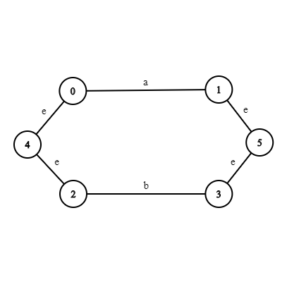
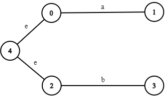
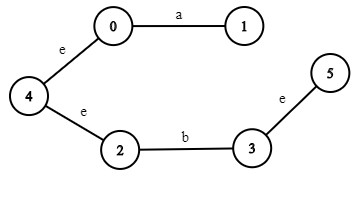

# CD Lab

## 1. Thomson's Construction 

Can use it to understand what is happening.

#### *A Node:*

```
  typedef struct Node {
    int dest;
    char edge;
    struct Node *next;
} Node;
     ______________________
    |       |      |       |
    |   1   |   a  |  NULL | 
    |_______|______|_______|   
    
```

####  *The graph array (final):*
```
  Node * graph[100]; 
  
   ______      ______________________
  |      |    |       |      |       |
 0|   ---|--->|   1   |   a  |  NULL | 
  |______|    |_______|______|_______|
  |      |    |       |      |       |
 1|   ---|--->|   5   |   e  |  NULL | 
  |______|    |_______|______|_______|
  |      |    |       |      |       |
 2|   ---|--->|   3   |   b  |  NULL | 
  |______|    |_______|______|_______|
  |      |    |       |      |       |
 3|   ---|--->|   5   |   e  |  NULL | 
  |______|    |_______|______|_______|      ______________________
  |      |    |       |      |       |     |       |      |       |
 4|   ---|--->|   2   |   e  |    ---|---->|   1   |   e  |  NULL | 
  |______|    |_______|______|_______|     |_______|______|_______|
  |      |
 5|      |
  |______|
  |      |
 .|      | 
  |      |
  
```
### i.e.:


#### *The counter variable:*
```
  int counter = 0;
```
###### It is used to keep count of each of states


#### The stack used:
###### It is used to store the destination node of each operand
```
  int stack[100], top = -1;
  
    |     |
    |_____|     
    |     |
    |  3  |
    |_____|     
    |     |
    |  1  |
    |_____|
```


#### construct function:
###### Used to construct an edge for each operand with it's opriginating and reaching nodes
```
  void construct(char c) {
    Node *n = (Node *)malloc(sizeof(Node));
    n->edge = c;
    n->dest = counter + 1;
    n->next = NULL;
    graph[counter] = n;
    push(counter+1);
    counter += 2;
}
```

###### This is equivalent to (in memory):
```
  graph[]
  for c = 'a' & counter = 0
   ______      ______________________
  |      |    |       |      |       |
 0|   ---|--->|   1   |   a  |  NULL | 
  |______|    |_______|______|_______|
  |      |
 1|      | 
  |      |
```
#### ```int main()``` function:
###### Till construction of each operand

```
int main() {
    char expr[100];
    printf("Enter postfix regexp\n");
    scanf("%s", expr); /* ab| */

    printf("Your regexp: %s\n", expr);

    int c = 0, q0;
    Node *F;
    for(; expr[c] != '\0'; c++) {
        if(expr[c] != '|') {
                construct(expr[c]);
                printf("Constructed %c\n", expr[c]);
         else {
              ...
              ...
          
 ```
 ### ```expr = "ab|"```
 ```
           _____________________________
          |       |      |       |      |
     expr |  'a'  |  'b' |  '|'  |  \0  |
          |_______|______|_______|______|
 ```
 
   ### 1st Iteration:
   ### when ```expr[c] = 'a'```
   ###### after ```construct('a')```:
   
   O/P: 'Constructed a' 

   ###### This is equivalent to (in memory):
   ```
    graph[]
     ______      ______________________
    |      |    |       |      |       |
   0|   ---|--->|   1   |   a  |  NULL | 
    |______|    |_______|______|_______|
    |      |
   1|      | 
    |      |
  ```
   ###### counter becomes 2 from 0

   ### 2nd Iteration:
   ### when ```expr[c] = 'b'```
   ###### after ```construct('b')```:
   
   O/P: 'Constructed b'

   ###### This is equivalent to (in memory):

   ```
     graph[]
      ______      ______________________
     |      |    |       |      |       |
    0|   ---|--->|   1   |   a  |  NULL | 
     |______|    |_______|______|_______|
     |      |
    1|      |
     |______|     ______________________
     |      |    |       |      |       |
    2|   ---|--->|   3   |   b  |  NULL | 
     |______|    |_______|______|_______|
     |      |
    3|      |
     |      |
   ```
   ###### counter becomes 4 from 2
   ### Thus, till here, we've
   
   
   
   
   #### ```main``` function (cont..):
   ### 3rd Iteration:
   when ```expr[c] = '|'```
    ```
         else {
            q0 = counter; /* 4 */
            printf("Initial state: %d\n", q0); /* 4 */
            F = perfOR();  
            ...
            ...
    ``` 
   ### ```Node * perfOR()``` function: (returns final state)
   #### Till construction of initial state:
   ```
    Node *perfOR() {

          int dest, i;
          Node *t;
   ```
   ###### ```t``` will point to initial state which is ```graph[4]```
   ### first-iteration of while loop in ```perfOR()```:
   ```
        while(1) {

              /* Get the top */
              if(top == -1) break;
              dest = pop(); /* get destination of one of the operand */
   ```
   ###### ```dest``` has destination of the last operand scanned
   ```
                                  |     |
             _____                |_____|
            |     | dest = pop()  |     |
      dest  |  3  |<--------------|--3  | 
            |_____|               |_____|
                                  |     |
                                  |  1  | 
                                  |_____|
                                   stack
   ```
   ###### create a node for e (epsilon) transition between inistial node and starting node of the operand 
   ```
              /* New node for initial state */
              Node *n = (Node *)malloc(sizeof(Node));
              n->edge = 'e'; /* epsilon */
              n->next = NULL;
               ______________________
              |       |      |       |
            n |       |   e  |  NULL | 
              |_______|______|_______|   
   ```
   ######  Search for the entry in graph array which points to a node whose destination = destination obtained by popping the stack
   ######  i.e. ```graph[i]->dest == dest```, where i gives the desired entry in graph array
   ```
             i = 0;
    
              while(graph[i]->dest != dest) i += 2;
   ```  
   ###### assign i with destination of new node for e-transition from initial state for performing OR operation
   ```
        n->dest = i;
       ______________________
      |       |      |       |
    n |   2   |   e  |  NULL | 
      |_______|______|_______|   
   ```
   ###### if entry corresponding to initial node in graph array is empty, assign it with e-transition 
   ```
        if(graph[counter] == NULL) graph[counter] = n;
   ```
   ###### i.e. 
   ```
     graph[]
      ______      ______________________
     |      |    |       |      |       |
    0|   ---|--->|   1   |   a  |  NULL | 
     |______|    |_______|______|_______|
     |      |
    1|      |
     |______|     ______________________
     |      |    |       |      |       |
    2|   ---|--->|   3   |   b  |  NULL | 
     |______|    |_______|______|_______|
     |      |
    3|      |
     |______|     ______________________
     |      |    |       |      |       |
    4|    --|--->|   2   |   e  |  NULL | 
     |______|    |_______|______|_______|   
     |      |
     |      |
   ```
  ### i.e
  
  ###### else go to end of nodes connected to that entry and make next assign it with the e-transition
  ```
              else {
                  t = graph[counter];
                  while(t->next) t = t->next;
                  t->next = n;
              }
          }
          
          ...
          ...
   ```
   ### second-iteration of while loop in ```perfOR()```:
   ```
        while(1) {

              /* Get the top */
              if(top == -1) break;
              dest = pop(); /* get destination of one of the operand */
   ```
   ###### ```dest``` has destination of the last operand scanned
   ```
   
                                  |     |
             _____                |_____|
            |     | dest = pop()  |     |
      dest  |  1  |<--------------|--1  | 
            |_____|               |_____|
                                    stack
   ```
   ###### create a node for e (epsilon) transition between inistial node and starting node of the operand 
   ```
              /* New node for initial state */
              Node *n = (Node *)malloc(sizeof(Node));
              n->edge = 'e'; /* epsilon */
              n->next = NULL;
                               ______________________
                              |       |      |       |
                            n |       |   e  |  NULL | 
                              |_______|______|_______|   
   ```
   ######  Search for the entry in graph array which points to a node whose destination = destination obtained by popping the stack
   ######  i.e. ```graph[i]->dest == dest```, where i gives the desired entry in graph array
   ```
             i = 0;
    
              while(graph[i]->dest != dest) i += 2;
   ```  
   ###### assign i with destination of new node for e-transition from initial state for performing OR operation
   ```
              n->dest = i;
       ______________________
      |       |      |       |
    n |   0   |   e  |  NULL | 
      |_______|______|_______|   
   ```
   ###### if entry corresponding to initial node in graph array is empty, assign it with e-transition 
   ```
        if(graph[counter] == NULL) graph[counter] = n;
   ```
   ###### here this condition will be false from second iteration onwards 
   ###### thus, else go to end of nodes connected to that entry and make next assign to e-transition
   ```
              else {
                  t = graph[counter];
                  while(t->next) t = t->next;
                  t->next = n;
              }
          }
          
          ...
          ...
   ```
   ###### i.e.
   ```
     graph[]
      ______      ______________________
     |      |    |       |      |       |
    0|   ---|--->|   1   |   a  |  NULL | 
     |______|    |_______|______|_______|
     |      |
    1|      |
     |______|     ______________________
     |      |    |       |      |       |
    2|   ---|--->|   3   |   b  |  NULL | 
     |______|    |_______|______|_______|
     |      |
    3|      |
     |______|     ______________________      ____________________
     |      |    |       |      |       |    |      |      |      |
    4|    --|--->|   2   |   e  |     --|--->|   0  |   e  | NULL |
     |______|    |_______|______|_______|    |______|______|______|      
     |      |
     |      |
   ```
   ###### i.e till here, we've:
   
   
   ###### Now remains construction of final state 
   ### ```perfOR()``` (cont..) after while loop:
   ```
          Node *F = (Node *)malloc(sizeof(Node));
          Node *n = graph[counter];
          counter++;
          F->edge = e;
          F->next = NULL;
          F->dest = counter;
          while(1) {
              i = n->dest;
              while(graph[i]) i = graph[i]->dest;
              graph[i] = F;
              if(n->next) n = n->next;
              else break;
          }
          return F;
      }
      
   ```
   #### create a final state node ```F```:
   ```
          Node *F = (Node *)malloc(sizeof(Node));
   ```
   #### ```n``` points to initial node (as ```counter = 4``` which is the initial state)
   ```
          Node *n = graph[counter];
          
          
          3|      |
           |______|      ______________________      ____________________
           |      |    |       |      |       |    |      |      |      |
     n--> 4|    --|--->|   2   |   e  |     --|--->|   0  |   e  | NULL |
           |______|    |_______|______|_______|    |______|______|______|     
            graph
   ```
   #### increment counter for representing final state which is 5:
   ```
          counter++;
   ```
   #### assign e-transition and destination to final state node F
   ```
          F->edge = e;
          F->next = NULL;
          F->dest = counter;
           ______________________
          |       |      |       |
         F|   5   |   e  |  NULL | 
          |_______|______|_______|   
   ``` 
   ### traverse the graph from initial state towards each operand linked to initial state:
   ```    
          while(1) {
              i = n->dest;
              while(graph[i]) 
                  i = graph[i]->dest;
              graph[i] = F;
              if(n->next) n = n->next;
              else break;
          }
          return F;
      }
   ```
   ### 1st iteration (outer while loop): (for operand b)
   ```
          while(1) {
            i = n->dest;
            ...
            ...
                                 |----> n->dest which is assigned to i   
                3|      |        |   
                 |______|     ___|__________________      ____________________
                 |      |    |       |      |       |    |      |      |      |
           n--> 4|    --|--->|   2   |   e  |     --|--->|   0  |   e  | NULL |
                 |______|    |_______|______|_______|    |______|______|______|     
                  graph
          
          thus, 
                  _____
                 |     |
            i -->|  2  |
                 |_____|
   ```
   ###### 1st iteration (inner while loop):
   ```
              ...
              ...
              
              while(graph[i]) 
                  i = graph[i]->dest;
              ...
              ...
              
              
                                    graph[]
                                    ______      ______________________
                                   |      |    |       |      |       |
                                  0|   ---|--->|   1   |   a  |  NULL | 
                                   |______|    |_______|______|_______|
                                   |      |
                                  1|      |         |----------------------> graph[i = 2]->dest which is now assigned to i 
                                   |______|     ____|_________________
                                   |      |    |       |      |       |
                graph[i = 2]----> 2|   ---|--->|   3   |   b  |  NULL | 
                                   |______|    |_______|______|_______|
                                   |      |
                                  3|      |
                                   |______|     ______________________      ____________________
                                   |      |    |       |      |       |    |      |      |      |
                                  4|    --|--->|   2   |   e  |     --|--->|   0  |   e  | NULL |
                                   |______|    |_______|______|_______|    |______|______|______|      
                                   |      |
                                   |      |
                                   
                            thus, 
                                    _____
                                   |     |
                              i -->|  3  |
                                   |_____|
                                
   ```
   
   ###### 2nd iteration (inner while loop):
   ```
              ...
              ...
              
              while(graph[i]) 
                  i = graph[i]->dest;
              ...
              ...
              
              
                                    graph[]
                                    ______      ______________________
                                   |      |    |       |      |       |
                                  0|   ---|--->|   1   |   a  |  NULL | 
                                   |______|    |_______|______|_______|
                                   |      |
                                  1|      |        
                                   |______|     _____________________
                                   |      |    |       |      |       |
                                  2|   ---|--->|   3   |   b  |  NULL | 
                                   |______|    |_______|______|_______|
                                   |      |
                 graph[i = 3]---->3|      |
                                   |______|     ______________________      ____________________
                                   |      |    |       |      |       |    |      |      |      |
                                  4|    --|--->|   2   |   e  |     --|--->|   0  |   e  | NULL |
                                   |______|    |_______|______|_______|    |______|______|______|      
                                   |      |
                                   |      |
   ```                                
   ###### Since ```graph[i = 3]``` is ```NULL``` (not pointing to any node), inner while loop terminates                          
   ### Outer while loop continues:
   ```

              graph[i] = F;
                        
                                F was:
                                   ______________________
                                  |       |      |       |
                                 F|   5   |   e  |  NULL | 
                                  |_______|______|_______|   

                                    graph[]
                                    ______      ______________________
                                   |      |    |       |      |       |
                                  0|   ---|--->|   1   |   a  |  NULL | 
                                   |______|    |_______|______|_______|
                                   |      |
                                  1|      |        
                                   |______|     _____________________
                                   |      |    |       |      |       |
                                  2|   ---|--->|   3   |   b  |  NULL | 
                                   |______|    |_______|______|_______|
                                   |      |    |       |      |       |
                                  3|   ---|--->|   5   |   e  |  NULL |     graph[i] = F;
                                   |______|    |_______|______|_______|     ____________________ 
                                   |      |    |       |      |       |    |      |      |      |
                                  4|    --|--->|   2   |   e  |     --|--->|   0  |   e  | NULL |
                                   |______|    |_______|______|_______|    |______|______|______|      
                                   |      |
                                   |      |
              
   ```
  #### thus, we are here now:
  
  
  ```
              if(n->next)
              
                                 
                3|      |                                         
                 |______|     ______________________       ____________________
                 |      |    |       |      |       |    |      |      |      |
           n--> 4|    --|--->|   2   |   e  |     --|--->|   0  |   e  | NULL |
                 |______|    |_______|______|_______|    |______|______|______|     
                  graph                                            |
                                                                   |---> n->next (thus if condition is true)
            
            Thus:
                  n = n->next;
                             
                3|      |           
                 |______|     ______________________      ____________________
                 |      |    |       |      |       |    |      |      |      |
                4|    --|--->|   2   |   e  |     --|--->|   0  |   e  | NULL |
                 |______|    |_______|______|_______|    |______|______|______|     
                  graph                                             |
                                                                    |---> n
              
              
  ```
  
  ### 2nd iteration (outer while loop): (for operand a)
  ##### Now, n points to :
   ```
          while(1) {
            i = n->dest;
            ...
            ...
                                                                    |----> n->dest which is assigned to i   
                3|      |                                           |
                 |______|     _____________________       __________|_________
                 |      |    |       |      |       |    |      |      |      |
                4|    --|--->|   2   |   e  |     --|--->|   0  |   e  | NULL |
                 |______|    |_______|______|_______|    |______|______|______|     
                  graph                                             |
                                                                    |
                                                                    |----> n (points to this node in 2nd iteration)
            
          thus, 
                  _____
                 |     |
            i -->|  0  |
                 |_____|
   ```
   ###### 1st iteration (inner while loop):
   ```
              ...
              ...
              
              while(graph[i]) 
                  i = graph[i]->dest;
              ...
              ...
              
                                                   |----------------------> graph[i = 0]->dest which is now assigned to i              
                                   graph[]         | 
                                    ______      ___|__________________
                                   |      |    |       |      |       |
                 graph[i = 0]---->0|   ---|--->|   1   |   a  |  NULL | 
                                   |______|    |_______|______|_______|
                                   |      |
                                  1|      |        
                                   |______|     _____________________
                                   |      |    |       |      |       |
                                  2|   ---|--->|   3   |   b  |  NULL | 
                                   |______|    |_______|______|_______|
                                   |      |    |       |      |       |
                                  3|   ---|--->|   5   |   e  |  NULL |     
                                   |______|    |_______|______|_______|     ____________________ 
                                   |      |    |       |      |       |    |      |      |      |
                                  4|    --|--->|   2   |   e  |     --|--->|   0  |   e  | NULL |
                                   |______|    |_______|______|_______|    |______|______|______|      
                                   |      |
                                   |      |
                                   
                            thus, 
                                    _____
                                   |     |
                              i -->|  1  |
                                   |_____|
                                
   ```
   
   ###### 2nd iteration (inner while loop):
   ```
              ...
              ...
              
              while(graph[i]) 
                  i = graph[i]->dest;
              ...
              ...
              
              
                                    graph[]
                                    ______      ______________________
                                   |      |    |       |      |       |
                                  0|   ---|--->|   1   |  a   |  NULL | 
                                   |______|    |_______|______|_______|
                                   |      |     
                 graph[i = 1]---->1|      |        
                                   |______|     ________________________
                                   |      |    |       |       |        |
                                  2|   ---|--->|   3   |   b   |  NULL  | 
                                   |______|    |_______|_______|_______ |
                                   |      |    |       |       |        |
                                  3|   ---|--->|   5   |   e   |  NULL  |
                                   |______|    |_______|______ |________|     ____________________
                                   |      |    |       |       |        |    |      |      |      |
                                  4|    --|--->|   2   |   e   |     ---|--->|   0  |   e  | NULL |
                                   |______|    |_______|______ |_______ |    |______|______|______|      
                                   |      |
                                   |      |
   ```                                
   ###### Since ```graph[i = 1]``` is ```NULL``` (not pointing to any node), inner while loop terminates                          
   ### Outer while loop continues:
   ```

              graph[i] = F;
                        
                                F was:
                                   ______________________
                                  |       |      |       |
                                 F|   5   |   e  |  NULL | 
                                  |_______|______|_______|   

                                    graph[]
                                    ______      ______________________
                                   |      |    |       |      |       |
                                  0|   ---|--->|   1   |   a  |  NULL | 
                                   |______|    |_______|______|_______|
                                   |      |    |       |      |       |
                                  1|   ---|--->|   5   |   e  |  NULL | graph[i] = F;
                                   |______|    |_______|______|_______|
                                   |      |    |       |      |       |
                                  2|   ---|--->|   3   |   b  |  NULL | 
                                   |______|    |_______|______|_______|
                                   |      |    |       |      |       |
                                  3|   ---|--->|   5   |   e  |  NULL |     
                                   |______|    |_______|______|_______|     ____________________ 
                                   |      |    |       |      |       |    |      |      |      |
                                  4|    --|--->|   2   |   e  |     --|--->|   0  |   e  | NULL |
                                   |______|    |_______|______|_______|    |______|______|______|      
                                   |      |
                                   |      |
              
   ```
  #### thus, we are here now (final):
  
  
  
  ```
              if(n->next)
              
                                 
                3|      |                                         
                 |______|     ______________________       ____________________
                 |      |    |       |      |       |    |      |      |      |
           n--> 4|    --|--->|   2   |   e  |     --|--->|   0  |   e  | NULL |
                 |______|    |_______|______|_______|    |______|______|___|__|     
                  graph                                                    |
                                                                           |---> n->next is NULL (thus if condition is false)
            
            Thus:
                  break;                           
  ```
   #### Thus end of while and end of ```perfOR()``` which returns ```F``` final state to ```main()```:
   ```
              return F;
   ```
   #### back to ```main``` where perfOR()``` was called which returned the final state of the e-NFA for a|b
   ```
                          F = perfOR();
              printf("Final State : %d\n", F->dest);
          }
      }
   ```
   ### next in main function, we have a call to ```traverse(w, q0, F)```  which is used to traverse the graph obtained by seeing the input string ```w``` from initial state ```q0``` to either intermediate states or final state ```F```
   ### If traversal reaches ```F```, input string ```w``` is accepted else rejected
   
   ### Call to ```traverse(w, q0, F)``` from ```main```:
   ```
          printf("Enter a string to test:\n");
          char w;
          scanf("%s", &w);
          traverse(w, q0, F);
      return 0;
    }
   ```
   ### ```traverse(w, q0, F)``` function:
   ```
          void traverse(char w, int q0, Node *F) {
          Node *n = graph[q0];
          int t;
          while(1) {
              t = n->dest;
              if(graph[t]->edge != w) {
                  if(n->next == NULL) {
                      printf("Rejected\n");
                      break;
                  } else n = n->next;
              } else {
                  while(1) {
                      if(graph[t]->dest == F->dest) {
                          printf("Accepted\n");
                          break;
                      } else t = graph[t]->dest;
                  }
              }
              if(graph[t]->dest == F->dest) break;
          }
      }
   ```


              
              
              
              
              
              
